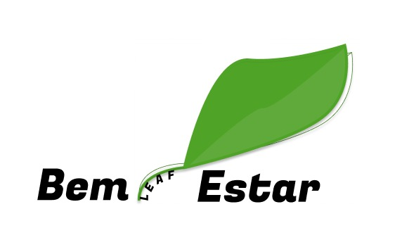

# Leaf Bem Estar

O bem-estar no Brasil e no mundo tem se tornado cada vez mais evidente por sua relação direta com a estética corporal e longevidade, pontos que são cada vez mais buscados por todos, a fim de, seja aparentar melhor, ter um corpo mais atletico para exercer esportes de alto nível ou evitar doenças, sejam elas físicas ou mentais, muito tem de relação com práticas e alimentações diárias. 

Em contraste com isso, é muito perceptível que o mundo tem se tornado cada vez mais acelerado e muitas das vezes, culturas como a do fast food acabam se tornando muito comum e por motivos como este existem dados que mostram que, em 2019, uma em cada quatro pessoas de 18 anos ou mais anos de idade no Brasil estava obesa, o equivalente a 41 milhões de pessoas. Já o excesso de peso atingia 60,3% da população de 18 anos ou mais de idade, o que corresponde a 96 milhões de pessoas, sendo 62,6% das mulheres e 57,5% dos homens e que durante e pós pandemia quadros como este se tornaram ainda mais comuns. Em um estudo realizado pelo Instituto de Medição e Avaliação da Saúde da Universidade de Washington (Health Metrics and Evaluation), mostra que em 2017 a má alimentação foi responsável por 1 em cada 5 óbitos no mundo. Uma das maiores consequências da má alimentação , está a obesidade e a diabetes. A pressão social por padrões de beleza , afeta principalmente as pessoas que sofrem de sobrepeso ou obesidade , podendo muitas vezes levar a pessoa a desenvolver transtornos de ansiedade , ansiedade social e depressão. A má alimentação lidera o ranking dos fatores de risco relacionados à carga global de doenças no mundo. O excesso de peso e doenças relacionadas serão responsáveis pela redução da expectativa de vida em 3 anos dos brasileiros e impactam na redução de 5% no Produto Interno Bruto do país.

Portanto, é notório que existam medidas que atenuem o problema gerado, onde nosso projeto busca mitigar problemas como este e melhorar o modo de viver, tendo uma interação dinâmica e simples para problemas que podem afetá-los, tornando mais simples a vida de quem busca.

## Alunos integrantes da equipe

* Arthur Santos Araujo
* Gabriel Lucas Pereira das Dores
* Heitor Meinicke Ribeiro
* Lucas Silva Tanure
* Marcos Vinicius Nunes Dos Santos
* Murilo Silva de Almeida

## Professor responsável

* Alexandre Teixeira

## Instruções de utilização

Assim que a primeira versão do sistema estiver disponível, deverá complementar com as instruções de utilização. Descreva como instalar eventuais dependências e como executar a aplicação.
