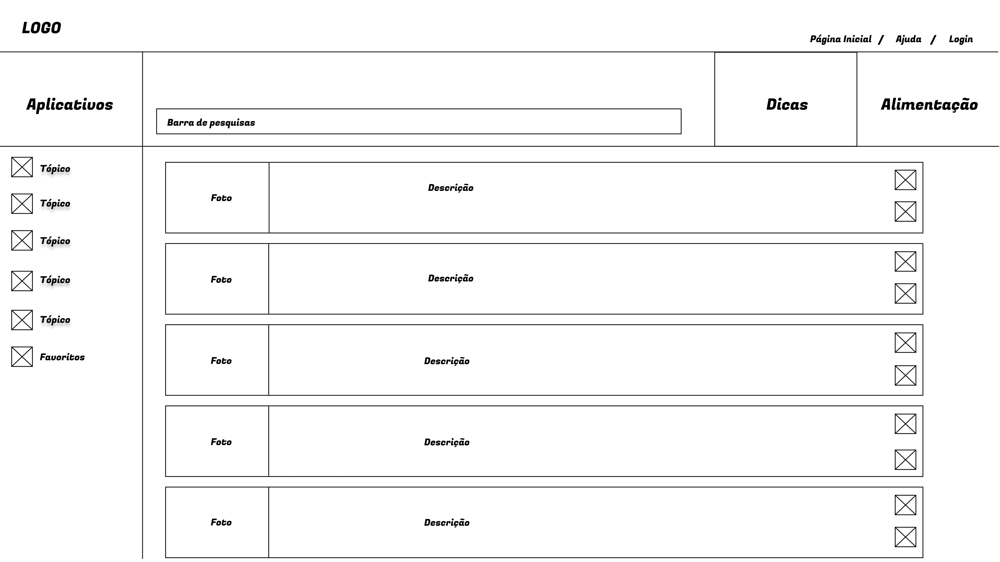

# Informações do Projeto
`TÍTULO DO PROJETO`  

LEAF BEM ESTAR

`CURSO` 

SISTEMAS DE INFORMAÇÃO 

## Participantes
- Arthur Santos Araujo
- Filipe Ribeiro Maciel Chang
- Gabriel Lucas Pereira das Dores
- Heitor Meinicke Ribeiro
- Lucas Silva Tanure
- Marcos Vinicius Nunes Dos Santos
- Murilo Silva de Almeida Silva

# Estrutura do Documento

- [Informações do Projeto](#informações-do-projeto)
  - [Participantes](#participantes)
- [Estrutura do Documento](#estrutura-do-documento)
- [Introdução](#introdução)
  - [Problema](#problema)
  - [Objetivos](#objetivos)
  - [Justificativa](#justificativa)
  - [Público-Alvo](#público-alvo)
- [Especificações do Projeto](#especificações-do-projeto)
  - [Personas e Mapas de Empatia](#personas-e-mapas-de-empatia)
  - [Histórias de Usuários](#histórias-de-usuários)
  - [Requisitos](#requisitos)
    - [Requisitos Funcionais](#requisitos-funcionais)
    - [Requisitos não Funcionais](#requisitos-não-funcionais)
  - [Restrições](#restrições)
- [Projeto de Interface](#projeto-de-interface)
  - [User Flow](#user-flow)
  - [Wireframes](#wireframes)
- [Metodologia](#metodologia)
  - [Divisão de Papéis](#divisão-de-papéis)
  - [Ferramentas](#ferramentas)
  - [Controle de Versão](#controle-de-versão)
- [**############## SPRINT 1 ACABA AQUI #############**](#-sprint-1-acaba-aqui-)
- [Projeto da Solução](#projeto-da-solução)
  - [Tecnologias Utilizadas](#tecnologias-utilizadas)
  - [Arquitetura da solução](#arquitetura-da-solução)
- [Avaliação da Aplicação](#avaliação-da-aplicação)
  - [Plano de Testes](#plano-de-testes)
  - [Ferramentas de Testes (Opcional)](#ferramentas-de-testes-opcional)
  - [Registros de Testes](#registros-de-testes)
- [Referências](#referências)

# Introdução

## Problema

Como foi abordado, esse projeto busca melhorar a saúde física e mental dos leitores, através de um conteúdo sobre  bem estar e alimentação saudável já que, segundo estudos houve um aumento na taxa  de sobrepeso da população brasileira durante a pandemia.

## Objetivos

“O objetivo geral deste trabalho é o desenvolvimento de um sistema que engloba adolescentes e jovens adultos que desejam trazer mais saúde para sua rotina , oferecendo um ambiente descontraído e intuitivo, que permita ao usuário conhecer novas técnicas direcionadas ao bem estar físico e psicológico”

Como objetivos específicos, podemos ressaltar:
- Fornecer ao usuário informações sobre maus hábitos alimentares e divulgar receitas que incentivem a boa alimentação;
- Permitir ao usuário a interação com o site, oferecendo o poder de escolha do conteúdo que deseja consumir;
- Entregar ao consumidor recomendações de aplicativos que podem o auxiliar usuários interessados em melhorar a saúde;

## Justificativa

Com a eclosão da pandemia causada pelo COVID-19 (coronavírus) , muitas pessoas foram forçadas a passar a maior parte do tempo em suas casas. O que contribuiu para a má alimentação. 

Em uma pesquisa Diet & Health Under , realizada em 30 países mostrou que , os brasileiros foram os que mais ganharam peso durante a pandemia , cerca de 52% dos brasileiros relataram ter ganho peso, na mesma pesquisa os brasileiros ganharam 6,5 quilos em média.

Diante disso, é de extrema importância ter bons hábitos de alimentação tendo em vista que  boa alimentação pode trazer muitos benefícios para a saúde como a melhora de condicionamento físico, um sistema imunológico mais forte, melhor disposição, entre outros.

## Público-Alvo

Apesar de todos poderem se beneficiar de uma atenção maior à saúde do corpo em geral, o foco desse projeto é o grupo de jovens que buscam adotar hábitos saudáveis mesmo não tendo tempo disponível ou conhecimento sobre os tópicos.

Desta forma, estabeleceu-se como público-alvo desta solução os homens e as mulheres entre 16 e 30 anos que buscam melhoras no seu estilo de vida. Sejam elas por se encontrar em estado de sedentarismo, com saúde mental afetada pelo isolamento, pessoas sobrecarregadas e consequentemente sem tempo, ou até mesmo pessoas com desconhecimento de informações de como cuidar do próprio bem estar.

 
# Especificações do Projeto

A definição exata do problema e os pontos mais relevantes a serem tratados neste projeto foi consolidada com a coleta de informação dos usuários em um trabalho de discussão feita pelos membros da equipe a partir da observação dos usuários e por meio de um formulário. Os dados levantados nesse processo foram consolidados na forma de personas e histórias de usuários.

## Personas e Mapas de Empatia

As pessoas apresentadas ajudaram no processo de entendimento do problema segue seus perfis abaixo

**Pedro Augusto**

**Isabella Gomes**

**Takuma Sato**

## Histórias de Usuários

Com base na análise das personas forma identificadas as seguintes histórias de usuários:

|EU COMO... `PERSONA`| QUERO/PRECISO ... `FUNCIONALIDADE` |PARA ... `MOTIVO/VALOR`                 |
|--------------------|------------------------------------|----------------------------------------|
|Pedro Augusto       |Diminuir as dores pelo corpo, principalmente a das costas| Para viver sem incômodos com seu corpo e poder ficar mais confortável |
|Pedro Augusto       |Ter mais autoestima                 |Para conseguir viver melhor consigo mesmo e com outras pessoas |
|Isabella Gomes      |Melhorar alimentação                |Para  ter mais disposição durante o dia |
|Isabella Gomes      |Ter mais apetite                    |Para poder se alimentar mais e se alimentar melhor|
|Takuma Sato         |Ter uma noite de sono melhor        |Para evitar cansaço durante o dia.      |
|Pedro Augusto       |Ganhar massa muscular               |Se sentir esteticamente melhor com seu corpo|
|Takuma Sato         |Ter hábitos mais saudáveis durante o dia|Diminuir o peso.                    |

## Requisitos

As tabelas que se seguem apresentam os requisitos funcionais e não funcionais que detalham o escopo do projeto.

### Requisitos Funcionais

|ID    | Descrição do Requisito  | Prioridade |
|------|-----------------------------------------|----|
|RF-001| Permitir ao usuário que adicione seus aplicativos, receitas e dicas aos favoritos.|MÉDIA|
|RF-002| Permitir ao usuário que tenha uma conta no site.|ALTA|
|RF-003| Permitir que o usuário filtre sua pesquisa|ALTA|
|RF-004| Permitir que o usuário faça pesquisa por palavras-chave.|MÉDIA|
|RF-005| Permitir ao usuário uma experiência pratica, interativa e intuitiva com botões expandindo e focalizando, por exemplo.|MÉDIA|
|RF-006| Permitir ao usuário que contate a equipe através do tópico "Ajuda".|MÉDIA|
|RF-007| Permitir que o usuário tenha navegação facilitada pelas opções no cabeçalho e rodapé da página.|MÉDIA|
|RF-008| Permitir com que o usuário acesse qualquer uma das outras telas independente de qual tela esteja.|ALTA|
|RF-009| Permitir ao usuário que identifique cada tópico por uma figura que representa o mesmo.|ALTA|
|RF-010| Permitir ao usuário que utilize o site sem ter uma conta com exceção de algumas ferramentas como os favoritos.|ALTA|
|RF-011| Garantir ao usuário conteúdos com de confiança e que possuam credibilidade.|ALTA|
|RF-012| Oferecer ao usuário mecanismos que facilitam seguir a proposta do projeto.|ALTA|

### Requisitos não Funcionais

|ID     | Descrição do Requisito  |Prioridade |
|-------|-------------------------|----|
|RNF-001| O sistema deve ser responsivo para rodar em um dispositivos móvel | MÉDIA | 
|RNF-002| Deve processar requisições do usuário em no máximo 3s |  BAIXA | 

## Restrições

O projeto está restrito pelos itens apresentados na tabela a seguir.

|ID| Restrição                                             |
|--|-------------------------------------------------------|
|01| O projeto deverá ser entregue até o final do semestre |
|02| Não pode ser desenvolvido um módulo de backend        |

# Projeto de Interface

Dentre as preocupações para a montagem da interface do sistema, estamos estabelecendo foco em questões como agilidade, acessibilidade e usabilidade. Desta forma, o projeto tem uma identidade visual padronizada em todas as telas que são projetadas para funcionamento em desktops e dispositivos móveis

> Apresente as principais interfaces da solução. Discuta como 
> foram elaboradas de forma a atender os requisitos funcionais, não
> funcionais e histórias de usuário abordados nas [Especificações do
> Projeto](#especificações-do-projeto).

## User Flow

**Fluxo de Usuário**

## Wireframes

**Tela Inicial**

**Pagina de Login**

**Pagina de Dicas**

**Pagina de Apps**

**Pagina de Alimentação**

# Metodologia

A metodologia contempla as definições de ferramental utilizado pela equipe tanto para a manutenção dos códigos e demais artefatos quanto para a organização do time na execução das tarefas do projeto.

## Divisão de Papéis

A equipe está organizada da seguinte maneira:

Scrum Master: Alexandre Teixeira
Product Owner: Puc Minas

`Equipe de Desenvolvimento:`
- Arthur Santos Araujo
- Filipe Ribeiro Maciel Chang
- Gabriel Lucas Pereira das Dores
- Heitor Meinicke Ribeiro
- Lucas Silva Tanure
- Marcos Vinicius Nunes Dos Santos
- Murilo Silva de Almeida Silva

## Ferramentas

| Ambiente  | Plataforma              |Link de Acesso |
|-----------|-------------------------|---------------|
|Documento do projeto| GoogleDocs | https://docs.google.com/document/d/1wdSI7h-elgUSJR1HLuFwpnzayYS76MJ8JW0hKdFewyU/edit?usp=sharing|
|Gerenciamento do projeto | Trello |  https://trello.com/b/yZERCd1N/bem-estar | 
|Repositório de código | GitHub | https://github.com/orgs/ICEI-PUCMinas-PSG-SI-TI/teams/bem-estar | 
|Comunicação da Equipe| Whatsapp |  grupo privado | 

- O GitHub foi escolhido por livre e espontânea pressão, mas de fato é o melhor gestor de versões de código
- O WhatsApp é a ferramenta de comunicação mais usada pelos brasileiros não tem porque não usar
- O GoogleDocs foi uma escolha pela opção de editar o documento por várias pessoas ao mesmo tempo

## Controle de Versão

Para gestão do código fonte do software desenvolvido pela equipe, o grupo utiliza um processo baseado no Git Feature Branch Workflow, mostrado na Figura a seguir. Desta forma, todas as manutenções no código são realizadas em branches separados

> A ferramenta de controle de versão adotada no projeto foi o
> [Git](https://git-scm.com/), sendo que o [Github](https://github.com)
> foi utilizado para hospedagem do repositório `upstream`.
> 
O projeto segue a seguinte convenção para o nome de branchs:

- `master`: versão estável já testada do software
- `unstable`: versão já testada do software, porém instável
- `testing`: versão em testes do software
- `dev`: versão de desenvolvimento do software
 
Quanto à gerência de issues, o projeto adota a seguinte convenção para
etiquetas:

- `bugfix`: uma funcionalidade encontra-se com problemas
- `enhancement`: uma funcionalidade precisa ser melhorada
- `feature`: uma nova funcionalidade precisa ser introduzida

# **############## SPRINT 1 ACABA AQUI #############**

# Projeto da Solução

......  COLOQUE AQUI O SEU TEXTO ......

## Tecnologias Utilizadas

......  COLOQUE AQUI O SEU TEXTO ......

> Descreva aqui qual(is) tecnologias você vai usar para resolver o seu
> problema, ou seja, implementar a sua solução. Liste todas as
> tecnologias envolvidas, linguagens a serem utilizadas, serviços web,
> frameworks, bibliotecas, IDEs de desenvolvimento, e ferramentas.
> Apresente também uma figura explicando como as tecnologias estão
> relacionadas ou como uma interação do usuário com o sistema vai ser
> conduzida, por onde ela passa até retornar uma resposta ao usuário.
> 
> Inclua os diagramas de User Flow, esboços criados pelo grupo
> (stoyboards), além dos protótipos de telas (wireframes). Descreva cada
> item textualmente comentando e complementando o que está apresentado
> nas imagens.

## Arquitetura da solução

......  COLOQUE AQUI O SEU TEXTO E O DIAGRAMA DE ARQUITETURA .......

> Inclua um diagrama da solução e descreva os módulos e as tecnologias
> que fazem parte da solução. Discorra sobre o diagrama.
> 
> **Exemplo do diagrama de Arquitetura**:
> 
> 

# Avaliação da Aplicação

......  COLOQUE AQUI O SEU TEXTO ......

> Apresente os cenários de testes utilizados na realização dos testes da
> sua aplicação. Escolha cenários de testes que demonstrem os requisitos
> sendo satisfeitos.

## Plano de Testes

......  COLOQUE AQUI O SEU TEXTO ......

> Enumere quais cenários de testes foram selecionados para teste. Neste
> tópico o grupo deve detalhar quais funcionalidades avaliadas, o grupo
> de usuários que foi escolhido para participar do teste e as
> ferramentas utilizadas.
> 
> **Links Úteis**:
> - [IBM - Criação e Geração de Planos de Teste](https://www.ibm.com/developerworks/br/local/rational/criacao_geracao_planos_testes_software/index.html)
> - [Práticas e Técnicas de Testes Ágeis](http://assiste.serpro.gov.br/serproagil/Apresenta/slides.pdf)
> -  [Teste de Software: Conceitos e tipos de testes](https://blog.onedaytesting.com.br/teste-de-software/)

## Ferramentas de Testes (Opcional)

......  COLOQUE AQUI O SEU TEXTO ......

> Comente sobre as ferramentas de testes utilizadas.
> 
> **Links Úteis**:
> - [Ferramentas de Test para Java Script](https://geekflare.com/javascript-unit-testing/)
> - [UX Tools](https://uxdesign.cc/ux-user-research-and-user-testing-tools-2d339d379dc7)

## Registros de Testes

......  COLOQUE AQUI O SEU TEXTO ......

> Discorra sobre os resultados do teste. Ressaltando pontos fortes e
> fracos identificados na solução. Comente como o grupo pretende atacar
> esses pontos nas próximas iterações. Apresente as falhas detectadas e
> as melhorias geradas a partir dos resultados obtidos nos testes.

# Referências

......  COLOQUE AQUI O SEU TEXTO ......

> Inclua todas as referências (livros, artigos, sites, etc) utilizados
> no desenvolvimento do trabalho.
> 
> **Links Úteis**:
> - [Formato ABNT](https://www.normastecnicas.com/abnt/trabalhos-academicos/referencias/)
> - [Referências Bibliográficas da ABNT](https://comunidade.rockcontent.com/referencia-bibliografica-abnt/)
